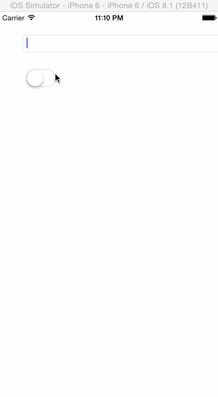

DKTextField.Swift
===========

## Description

**DKTextField.Swift**是https://github.com/zhangao0086/DKTextField Swift语言版本。
由于系统的UITextField在切换到暗码时会清除之前的输入文本，于是就有了`DKTextField`，`DKTextField`继承于UITextField，并且不影响UITextField的Delegate。

##Install

下载源代码将`DKTextField.Swift`文件拷贝至工程

## Preview

